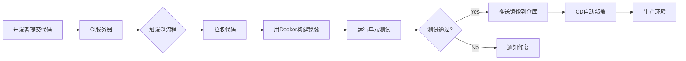

```mermaid
graph LR
A[开发者提交代码] --> B[CI服务器]
B --> C{触发CI流程}
C --> D1[拉取代码]
D1 --> D2[用Docker构建镜像]
D2 --> D3[运行单元测试]
D3 --> E{测试通过?}
E --> |Yes| F[推送镜像到仓库]
E --> |No| G[通知修复]
F --> H[CD自动部署]
H --> I[生产环境]


```